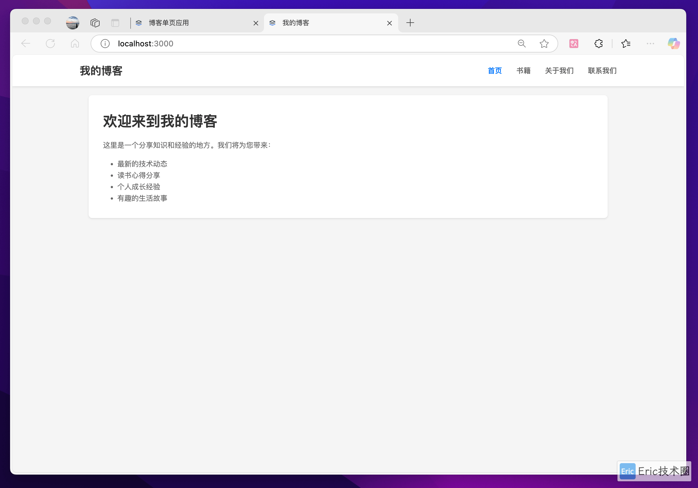
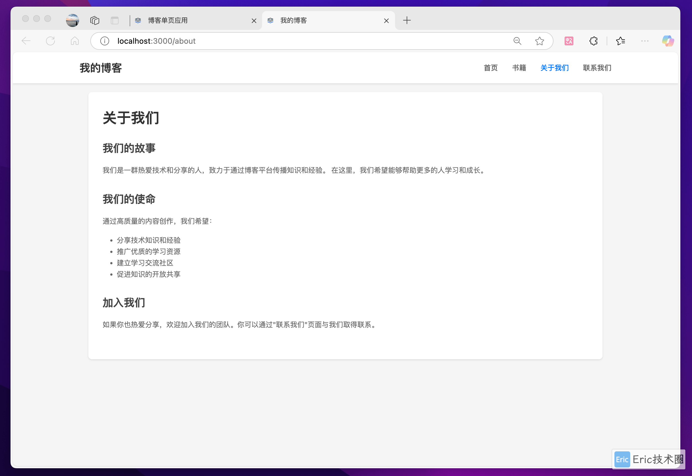
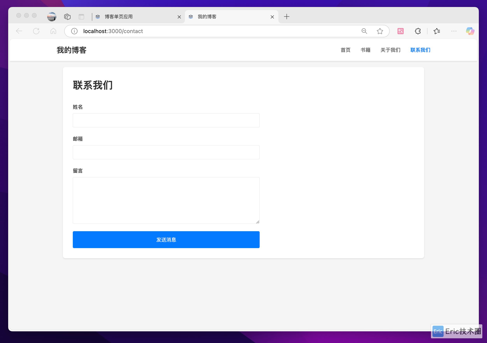
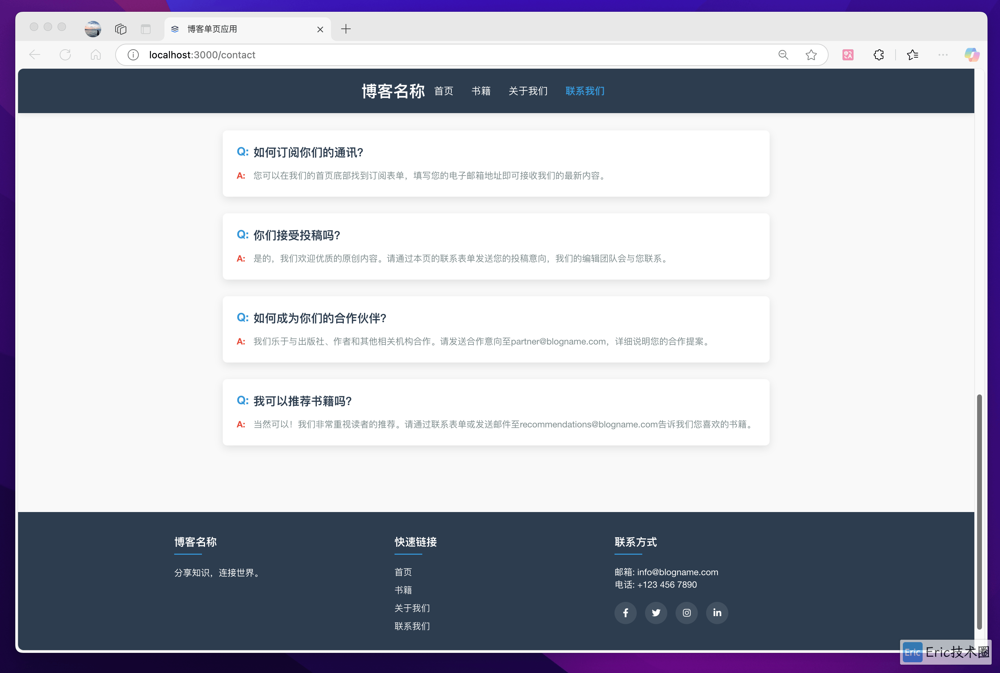

# Claude 3.5 vs 3.7 Code Comparison

> **Tutorial Link**: [https://flyeric.top/archives/claude-3.5-vs-3.7-code-comparison](https://flyeric.top/archives/claude-3.5-vs-3.7-code-comparison)

This repository contains a comparison of frontend programming capabilities between Claude 3.5 and Claude 3.7 AI models in the Cursor editor environment. The project aims to evaluate and showcase the differences in code generation, problem-solving approaches, and overall effectiveness of these AI models in frontend development tasks.

## Project Structure

The repository is organized into two main directories:

- `claude3.5/` - Contains code generated by Claude 3.5
- `claude3.7/` - Contains code generated by Claude 3.7

## Test Categories

Each AI model was tested on three different frontend development tasks:

### 1. Frontend Replication
Recreating the Cursor official website UI from screenshots, testing the AI's ability to translate visual designs into functional code.

claude 3.5:

claude 3.7:

...

### 2. Traditional Framework Application
Implementing a login page using HTML, CSS, and JavaScript, evaluating the AI's proficiency with fundamental web technologies.

claude 3.5:

claude 3.7:

### 3. Single Page Application
Developing a blog application using React, assessing the AI's capability to work with modern frontend frameworks and create interactive user interfaces.

claude 3.5:

claude 3.7:

## Purpose

This comparison project serves to:

- Highlight the strengths and limitations of each Claude AI version
- Provide insights into how AI capabilities have evolved between versions
- Demonstrate practical applications of AI-assisted coding in frontend development
- Serve as a reference for developers interested in AI-powered development tools

## Getting Started

To explore the code samples:

1. Navigate to either the `claude3.5/` or `claude3.7/` directory
2. Each directory contains subdirectories for the three test categories
3. Review the code and implementation approaches used by each AI model

## Contribution

Feel free to fork this repository and conduct your own comparisons or extend the existing tests to cover additional aspects of frontend development.

## More Information

For detailed articles and analysis on this comparison, search for the WeChat Official Account: Eric技术圈 or Blog: flyeric.top.

## License

This project is licensed under the MIT License - see the [LICENSE](LICENSE) file for details.